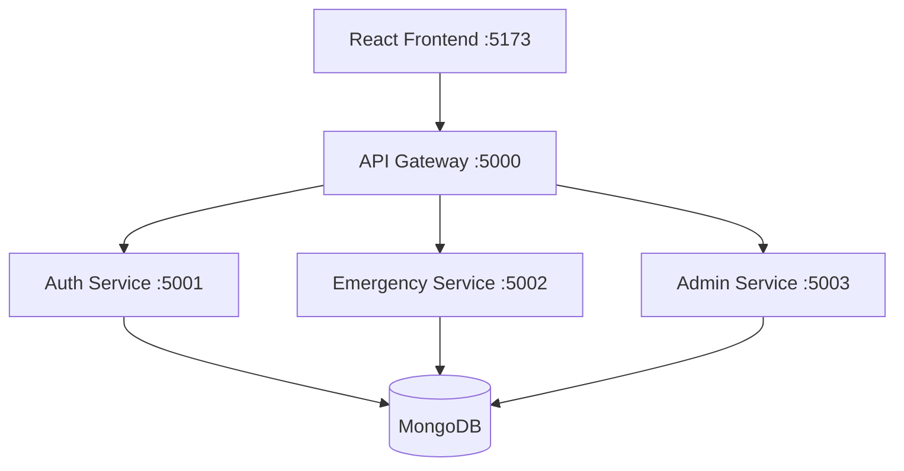

# Emergency Resource Locator and Response System

A microservices-based MERN application for reporting emergencies, tracking response progress, and enabling administrative oversight through a centralized dashboard.

## Why this project?

Built for **campus emergency operations and resource coordination**, this system:
- lets users securely report emergencies,
- tracks request status from creation to completion,
- provides admin-only visibility into system-wide stats and user management,
- routes all client traffic through a single **API Gateway**.

---

## Table of Contents

- [Overview](#overview)
- [Features](#features)
- [System Architecture](#system-architecture)
- [Tech Stack](#tech-stack)
- [Project Structure](#project-structure)
- [Service Ports](#service-ports)
- [Quick Start (Docker)](#quick-start-docker)
- [Run Locally (Dev)](#run-locally-dev)
- [Environment Variables](#environment-variables)
- [API Documentation](#api-documentation)
- [User Roles and Access Control](#user-roles-and-access-control)
- [Frontend Routes](#frontend-routes)
- [Troubleshooting](#troubleshooting)
- [Future Improvements](#future-improvements)

---

## Overview

This project separates responsibilities into multiple backend services behind an API Gateway, with a React frontend consuming only gateway routes.

Core capabilities include:
- User registration and login
- Authenticated emergency report submission
- Request lifecycle tracking
- Admin-only global statistics and user management views

---

## Features

- Authentication with JWT tokens
- Role-based authorization (**user** and **admin**)
- Emergency request creation with required and optional fields
- Status transitions: `pending` → `in-progress` → `completed`
- Admin dashboard for statistics and users list
- API Gateway as a single entry point for frontend calls
- Dockerized full-stack deployment

---

## System Architecture



**Request flow (high-level):**
1. Frontend calls the API Gateway (`/api/...`)
2. Gateway proxies to internal services (auth/emergency/admin)
3. Services persist data in MongoDB

---

## Tech Stack

### Frontend
- React 18
- TypeScript
- Vite
- Tailwind CSS
- React Router

### Backend
- Node.js
- Express
- Mongoose
- JWT (`jsonwebtoken`)
- `bcryptjs`
- Axios (service-to-service and gateway proxying)

### Infrastructure
- MongoDB
- Docker + Docker Compose

---

## Project Structure

```text
Emergency-Response-main/
  backend/
    api-gateway/
    auth-service/
    emergency-service/
    admin-service/
    middleware/
  frontend/
  docker-compose.yml
  README.md
```

---

## Service Ports

| Component | Port |
|----------|------|
| Frontend (Vite dev) | 5173 |
| Frontend (Docker) | 80 |
| API Gateway | 5000 |
| Auth Service | 5001 |
| Emergency Service | 5002 |
| Admin Service | 5003 |
| MongoDB | 27017 |

---

## Quick Start (Docker)

From the project root:

```bash
docker compose up --build
```

After startup:
- Frontend: `http://localhost`
- API Gateway: `http://localhost:5000`
- Gateway health: `http://localhost:5000/health`

---

## Run Locally (Dev)

> You’ll need separate terminals for each service.

### 1) Install dependencies

```bash
cd backend/auth-service
npm install

cd ../emergency-service
npm install

cd ../admin-service
npm install

cd ../api-gateway
npm install

cd ../../frontend
npm install
```

### 2) Configure environment variables

Create `.env` files in backend services as needed.

Minimum requirement:
- `auth-service` requires `JWT_SECRET`

> Security note: **Never commit real secrets**. Use `.env` locally and secret managers in deployment.

### 3) Start backend services

```bash
cd backend/auth-service
npm run dev
```

```bash
cd backend/emergency-service
npm run dev
```

```bash
cd backend/admin-service
npm run dev
```

```bash
cd backend/api-gateway
npm run dev
```

### 4) Start frontend

```bash
cd frontend
npm run dev
```

Frontend URL: `http://localhost:5173`

---

## Environment Variables

Below are the supported variables and defaults.

### auth-service
- `PORT` (default `5001`)
- `MONGODB_URI` (default `mongodb://127.0.0.1:27017/auth_db`)
- `JWT_SECRET` (**required**)

### emergency-service
- `PORT` (default `5002`)
- `MONGODB_URI` (default `mongodb://127.0.0.1:27017/emergency_db`)
- `JWT_SECRET` (required for protected routes)

### admin-service
- `PORT` (default `5003`)
- `MONGODB_URI` (default `mongodb://127.0.0.1:27017/admin_db`)
- `AUTH_SERVICE_URL` (default `http://127.0.0.1:5001`)
- `EMERGENCY_SERVICE_URL` (default `http://127.0.0.1:5002`)
- `JWT_SECRET` (required for protected routes)

### api-gateway
- `PORT` (default `5000`)
- `AUTH_SERVICE_URL` (default `http://127.0.0.1:5001`)
- `EMERGENCY_SERVICE_URL` (default `http://127.0.0.1:5002`)
- `ADMIN_SERVICE_URL` (default `http://127.0.0.1:5003`)

---

## API Documentation

All client requests should go through the **API Gateway**:
- Base URL: `http://localhost:5000/api`

### Health

#### `GET /health`
Returns gateway status and service URLs.

---

### Auth Routes

#### `POST /api/auth/register`
Create a new account.

**Request body**
```json
{
  "email": "user@example.com",
  "password": "password123"
}
```

#### `POST /api/auth/login`
Authenticate user and return JWT.

**Request body**
```json
{
  "email": "user@example.com",
  "password": "password123"
}
```

**Response**
```json
{
  "token": "jwt-token",
  "user": {
    "email": "user@example.com",
    "role": "user"
  }
}
```

#### `GET /api/auth/all-users`
Returns all users (used internally by admin service).

---

### Emergency Routes

All emergency routes require an Authorization header:

```text
Authorization: Bearer <token>
```

#### `POST /api/emergencies/create`
Create an emergency request.

**Request body**
```json
{
  "type": "Medical Emergency",
  "location": "Block A, Room 203",
  "description": "Student unconscious"
}
```

#### `GET /api/emergencies/list`
Get all requests sorted by latest timestamp.

#### `PATCH /api/emergencies/update/:id`
**Admin only.** Update request status.

**Request body**
```json
{
  "status": "in-progress"
}
```

Allowed `status` values:
- `pending`
- `in-progress`
- `completed`

#### `GET /api/emergencies/stats`
**Admin only.** Get global emergency stats.

**Response**
```json
{
  "total": 20,
  "pending": 8,
  "inProgress": 7,
  "completed": 5
}
```

---

### Admin Routes

All admin routes require:
- Valid JWT
- `user.role === "admin"`

#### `GET /api/admin/users`
Fetches all users from auth service.

#### `GET /api/admin/stats`
Fetches global emergency stats from emergency service.

---

## User Roles and Access Control

- **user**
  - Register and login
  - Create emergency requests
  - View request list

- **admin**
  - All user permissions
  - Update emergency status
  - Access admin users and statistics endpoints

---

## Frontend Routes

- `/login`
- `/register`
- `/dashboard`
- `/emergency/new`
- `/admin` (admin users only)

---

## Troubleshooting

1) **Auth service exits on startup**
- Cause: `JWT_SECRET` is missing
- Fix: Add `JWT_SECRET` in `backend/auth-service/.env`

2) **401 Access token required**
- Cause: Missing Authorization header
- Fix: Send Bearer token from login response

3) **403 Invalid or expired token**
- Cause: Invalid token or JWT secret mismatch
- Fix: Re-login and ensure all services share the same `JWT_SECRET`

4) **403 Admin access required**
- Cause: Logged in as non-admin user
- Fix: Login using an account with role set to `admin`

5) **Gateway returns service unavailable**
- Cause: Downstream service not running
- Fix: Verify all backend services are running on expected ports

---

## Future Improvements

- Automatic assignment of nearest emergency resource
- Real-time notification channels
- Audit logs for admin actions
- Request filtering and search
- Unit and integration test coverage
