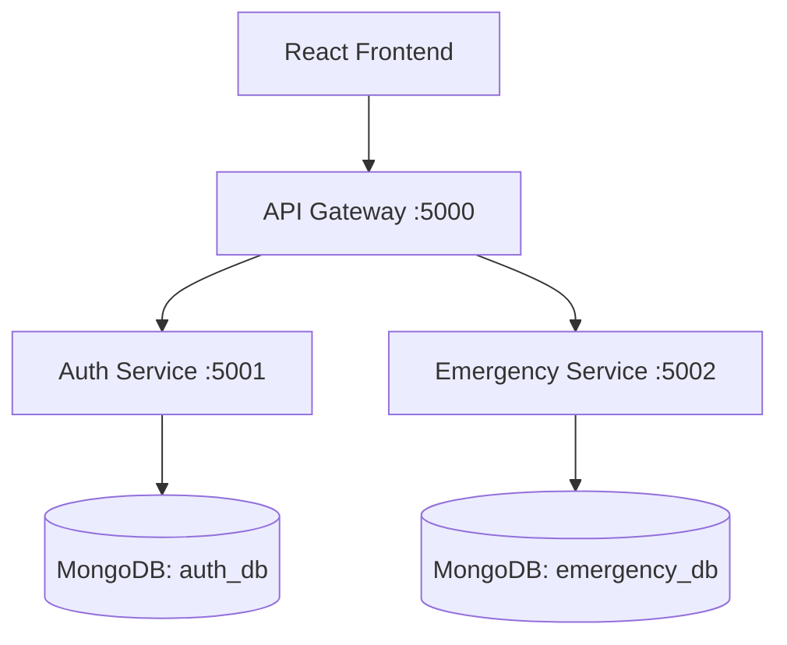

# MERN Microservices Backend Walkthrough

The Emergency Response System has been migrated to a modern MERN-stack microservices architecture. This walkthrough provides an overview of the changes and instructions on how to run the system.

## Architecture Overview

The system consists of three backend services and a React frontend, all communicating through an API Gateway.



## Services Implemented

### 1. API Gateway (`backend/api-gateway/`)
- Acts as the entry point for the frontend.
- Routes `/api/auth/*` to the Auth Service.
- Routes `/api/emergencies/*` to the Emergency Service.

### 2. Auth Service (`backend/auth-service/`)
- Handles user registration and login.
- Uses JWT for session management.
- Stores user credentials securely using `bcryptjs`.

### 3. Emergency Service (`backend/emergency-service/`)
- Manages the lifecycle of emergency requests.
- Supports creating, listing, and updating the status of emergencies.

## How to Run

> [!IMPORTANT]
> Ensure MongoDB is running on your system (default port 27017).

### Step 1: Start Backend Services
Open four separate terminals and run the following in each:

**Terminal 1 (Auth Service):**
```bash
cd backend/auth-service
node index.js
```

**Terminal 2 (Emergency Service):**
```bash
cd backend/emergency-service
node index.js
```

**Terminal 3 (API Gateway):**
```bash
cd backend/api-gateway
node index.js
```

### Step 2: Start Frontend
**Terminal 4 (Frontend):**
```bash
cd frontend
npm run dev
```

## Verification Steps

1. **Register/Login**: Go to the login page, create a new account, and then sign in.
2. **Raise Emergency**: Submit a new emergency report and verify it appears on the dashboard.
3. **Update Status**: On the dashboard, use the "Take Action" or "Resolve" buttons to update the status of requests.
4. **Database Check**: Verify that data is persisting in MongoDB across service restarts.

---
Implementation completed by Antigravity.
